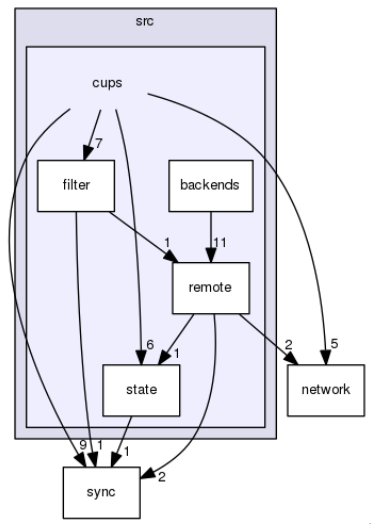
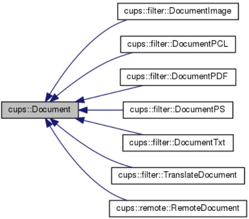
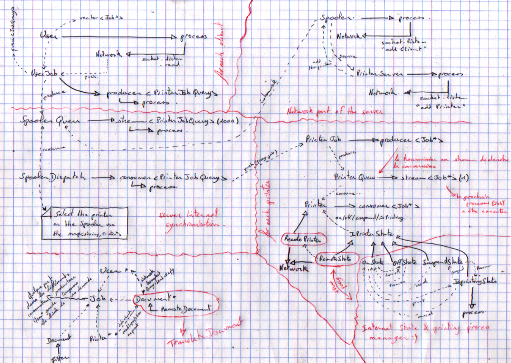
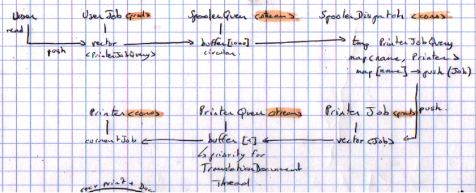
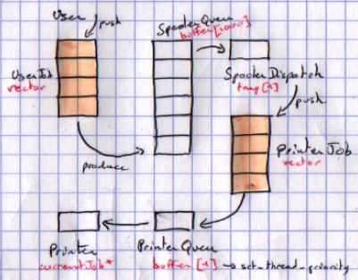
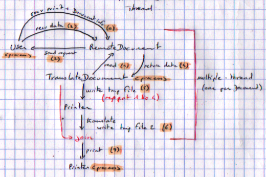
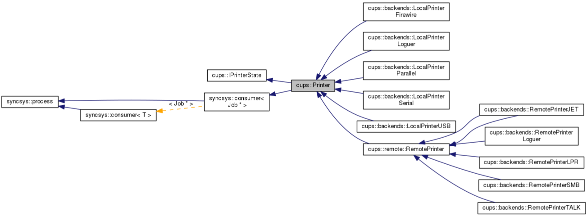
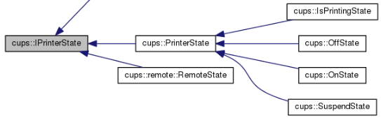

# Posix Process Synchronization

Management of printouts in a system

« any code should be self-documenting with a clear semantic »

## Each machine is represented by a dedicated application

- server → which is obviously the Print Spooler.
- client → which obviously represents the user deamon of interconnection with the Spooler.
    - Ideally, the client uid should be transmitted to restore the print queue.
    - if a user disconnects, his process on the server is then suspended, as he is unreachable to receive a notification or document request.
- printer → which represents a remote printer in a protocol (IPP, TALK, JET, ...)
    - does not intervene in the synchronization model since the network guarantees synchronization via a single socket, the commands are simply transmitted via a virtual printer (by datagram) which simply uses the Printer model "provided" by Jehan (hence the presence of copyright).
    - and moreover the remote printers are supposed to already exist ;)

Each machine obviously has a correspondence within the object model of the server both for the network and for the different synchronizations :

- server → Spooler (net)
  - SpoolerQueu → SpoolerQueu → `stream<PrinterJobQuery>`
  - SpoolerDispatch → `consumer<PrinterJobQuery> to producer<Job*>`
- client → User (net)
  - remote::RemoteDocument (file transfer)
  - UserJobs → `producer<PrinterJobQuery>`
- printer → remote::RemotePrinter and remote::PrinterServer(net)
  - Printer `consumer<Job*>`
  - PrinterQueu `stream<Job*>`
  - PrinterJobs `producer<Job*>`

Several classes and generic classes have been developed to simplify the use in the main framework, which can be found everywhere either as inheritance, attribute or object function. Everything concerning the network (address, file_descriptor, socket, ...) and what concerns synchronization via an mpmc (producer, stream, consumer) and process management (process and lock_guard) is therefore developed as an external module. The rest of the application is also fragmented into sub-module to simplify the design and reduce coupling.

## Users of the printing service

As requested the user can print different types of files, the user machine does a pre-conversion to a single format for the spooler (CUPS-PostScript), which is then transformed to a printer-specific format in a thread before being processed. When the print request is consumed to be dispatched to the requested printer, the Document is then "decorated" by a TranslateDocument.

This TranslateDocument takes care of launching a thread to retrieve the document locally, via RemoteDocument and save it in a temporary file to apply printer-specific processing to another unique temporary file that corresponds to the list of commands to be used.

In the diagram if against, a Document is loaded on the client side, and added to the queue for local conversion processing and acts as a pre-filter (conversion to cups-postscript) which is then received and processed on the server as a post-filter (conversion to cups-raster→ TranslateDocument).

When the associated Job is supported by the printer, the printer simply waits for the conversion process to finish before starting the processing. This modeling also allows each user to define his own conversion methods or to install others locally (using the design pattern strategy).

To simplify the use, and as "recommended" a DocumentFactory is available to provide the corresponding type of Document. The last class remote::RemoteDocument is there to take care of the file transfer between the user and the printer.

The user can of course send the following commands to the server :

- submit print jobs over the network via the client application
  - with a specific printer (via its pseudo url)
  - set a number of copies
  - recto / verso
  - the customer's identifier
- know the progress of a print job
  - the server keeps the list of submitted jobs
  - each time the Job changes status on the Spooler the customer is notified (packet)
- change the status of a print job
  - if it is on hold, it can be cancelled
  - if it is being printed, it can be either suspended or cancelled
  - if it is suspended, it can either be resumed or cancelled

## printing server

A good drawing is better than a novel, the following diagram simply represents the different interactions between objects on the server.

When a client connects to the server, two threads are created, one for the network (User), and the other (UserJob) to produce a PrinterJobQuery that contains the printer name and the Job, which is then stored both at the client (list of Jobs submitted for update) and on the SpoolerQueu stream.

A first SpoolerDispatch consumer is present to distribute the request from SpoolerQueu to the correct PrinterJob producer (which stores the printer waiting list), the latter is attached to a PrinterQueu of size 1 which protects the transmission of the next job that the consumer (the printer) will take over.

So we have :
- 2 client threads (socket+UserJob)
- 3 server thread (socket+SpoolerQueu+SpoolerDispatch)
- 2 thread printer (PrinterJob+Printer)
- 1 thread per TranslateDocument
- 1 PrinterServer thread (dynamicaly register new Printer)
  - instantiate RemotePrinter & related thread
  

For transmission and translation (CUPS-Filter and CUPS-Raster) : When the customer makes a print request, the document information is sent. Such as the path on the remote machine, type, number of lines, and number of pages. This information is then stored in a RemoteDocument object that will be decorated by a TranslateDocument when passing between SpoolerDispatch and PrinterJob. This TranslateDocument is in charge of launching the thread that will allow to request each part of the file (steps 1 to 4 on the diagram).

All this information is then stored in a temporary file in /tmp. Once the file has been completely received, TranslateDocument will use the translate method (CUPS-Raster) of the printer used by the Job. This method will take care of translating the remote file (sent in unique PostScript format, therefore pre-filtered) to the specific format of the target printer, which is then stored again in a new temporary file.

Each type of printer, therefore re-implements the translate method, to make the translation to the format that corresponds to it, this method does not modify the instantiated object but cannot be declared static to benefit from the virtual tables. It is therefore simply const it can be called simply from any thread, without any synchronization.

Note that this model has been designed to be future modified so that the Spooler will finally connect to a mini server for each printer so that it is possible to have several print servers that have different printers shared, allowing to manage rights or load balancing.

## printers

A printer can be local or remote, so I simply modeled a Printer class which is derived as follows:

Each subclass is therefore the representation of a communication protocol with a local printer (USB/Firewire/Parallel/Serial/Loguer) or remote printer via RemotePrinter and subprotocols (JET/LPR/SMB/TALK/Loguer). Currently the *Loguer classes are here to symbolize Printers in debug mode, so recording of interactions, network ... .

Each printer also has a view on the state it is in and allows to manage the printing process, so it is a bit like a state machine: each one gives the hand to the other and allows to interact indirectly on the process managed by IsPrintingState (waiting, resuming, printing, cancelling).

When the current state receives the following change of state :
    - print : the process is launched (if available)
    - suspend: the process is suspended with a semaphore (if in print)
    - summary: post on the previously described semaphore (if suspended)
    - cancel : cancel the print thread (if not available)

The Printer class also implements the "method" `std::string translate (const std::string &filename)` which when overloaded translates CUPS-PostScript to CUPS-Raster on the cups documentation. For this TP it represents the filters associated to a printer, since I decided to apply a pre-filter that the customer will perform to a standard format (here PostScript) according to CUPS and perform on a process for parallel processing.